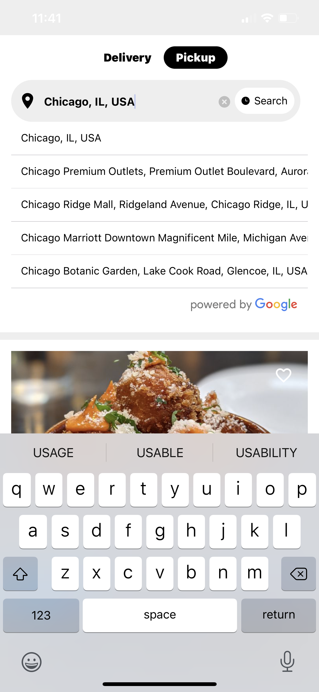

# Restaurant Locator Native Script

Restaurant Locator in React Native. Used Yelp API to query for restaurants based on cities using Google Places API.

Every restaurant result is also clickable which will navigate(using react-native navigation) you to a details screen of the Restaurant with a fake menu list.

## Query Search using Google Places Autocomplete and Google Places API

## Query Result 1

## Query Result 2

## Restaurant Item

